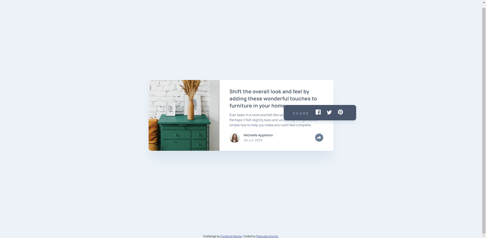

# Frontend Mentor - Article preview component solution

This is a solution to the [Article preview component challenge on Frontend Mentor](https://www.frontendmentor.io/challenges/article-preview-component-dYBN_pYFT). Frontend Mentor challenges help you improve your coding skills by building realistic projects. 

## Table of contents

- [Frontend Mentor - Article preview component solution](#frontend-mentor---article-preview-component-solution)
  - [Table of contents](#table-of-contents)
  - [Overview](#overview)
    - [The challenge](#the-challenge)
    - [Screenshot](#screenshot)
    - [Links](#links)
  - [My process](#my-process)
    - [Built with](#built-with)
    - [What I learned](#what-i-learned)
    - [Continued development](#continued-development)
    - [Useful resources](#useful-resources)
  - [Author](#author)

## Overview

### The challenge

Users should be able to:

- View the optimal layout for the component depending on their device's screen size
- See the social media share links when they click the share icon

### Screenshot

### Links

- Solution URL: [Add solution URL here](https://your-solution-url.com)
- Live Site URL: [Add live site URL here](https://your-live-site-url.com)

## My process

### Built with

- Semantic HTML5 markups
- CSS custom properties
- Flexbox
- Responsive development
- [Vanilla JavaScript](https://developer.mozilla.org/en-US/docs/Web/JavaScript)

### What I learned

In this challenge I learned how to show a mini-popup on the click of a button in Vanilla JavaScript, that means without any framework, library o plugin to help me doing that.

### Continued development

I can improve my JavaScript skills in order to write better code. The code I wrote it's ok and works, but I think I can do better than that.
Moreover, I can be more accurate in the style development.

### Useful resources

- [Google Fonts](https://fonts.google.com/) - This is a computer font and web font service owned by Google. This includes free and open source font families, an interactive web directory for browsing the library, and APIs for using the fonts via CSS and Android. You can choose and import in your project one or many fonts. Popular fonts in the Google Fonts library include Roboto, Open Sans, Lato, Oswald, Montserrat, Source Sans Pro, and Raleway.

## Author

- Check out my Frontend Mentor profile - [@pasqualegiorgio](https://www.frontendmentor.io/profile/pasqualegiorgio)
- Check out my GitHub profile - [pasqualegiorgio](https://github.com/pasqualegiorgio)
- Check out my coding community - [Coding Bunker](https://linktr.ee/codingbunker)